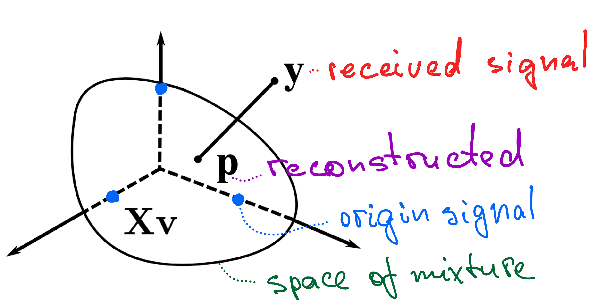

# Signal separation

During inventory in a densely packed stock, multiple radio-frequency data transmitters often interfere with each other, leading to signal collisions. This reduces the efficiency of inventory. We present a method to resolve these collisions. The good news: despite these collisions, the items can still be identified, and their signals can be reconstructed. This advancement greatly enhances the performance of radio-frequency identification (RFID) systems.

\#RFID, \#I/Q data,  \#Aloha collision, \#Signal separation, \#Self-modeling

# Table of contents for the project
1. [Report on the signal separation](https://medium.com/p/d56a210dae9a) 
2. [Run the demo of the I/Q data signal separation](/main#readme)
3. [Report on the collision detection, pdf](/latex/CollisionDetector.pdf)
1. [Inphase-Quadratire data readme](/data#readme)
2. [Some examples of the I/Q data signal processing](/ipynb#readme).
3. [References and introduction to signal separation](/latex#readme).
4. [Illustrations of the signals](/figures/#readme)

# The birthday paradox and probability of collision-free
The Aloha protocol resolves a mixture of replies: the inventory time-segment splits into time-slots.  At request, each tag waits a random number of time slots and replies. 
Due to this randomness, some  time slots are left  unoccupied, some time slots keep a single tag ID, but some are still occupied by several tags.  Can we avoid collisions in one inventory cycle? The problem of estimating of probability that two tags hit one slot is called [the birthday paradox](https://dialnet.unirioja.es/descarga/articulo/5997063.pdf). What is the probability that two people have their birthdays on the same day? One tag hits any of $`D`$ slots with the probability of $`\frac{1}{D}`$. Two tags do not hit the same slot with the probability $`1-\frac{1}{D}`$. The third tag cannot hit both occupied slots, so the probability is
```math
\frac{D-1}{D} \frac{D-2}{D} = \left(1-\frac{1}{D}\right) \left(1- \frac{2}{D}\right).
```
So for given~$`D`$ slots,  the probability that none of~$`N`$ tags do not collide is
```math
\frac{D!}{D^N(D-N)!}.
```
The figure shows that the probability of a successful inventory is small for any reasonable number of tags. So if the shopping cart has over 100 items with tags, most likely there is a collision even for a long inventory cycle. See the green and red lines. 

The probability of a collision-free inventory of any of $`N`$ given $`D`$ time-slots.

If, with an insufficient number of slots, there is no initial period where the probability of getting two transmitters in one slot increases. That is, if there are enough transmitters to overlap at all, they will *immediately start colliding* in the slot.

Briefly, *the collision is unavoidable in one inventory cycle.*


## Inphase-Quadrature Data signal self-modeling
The collision should be detected to avoid inventory errors. But there is no error in the signals, reconstructed after the collision. So we suppose two or more tags transmit at the same time. 


*A tag emits an ultra-high-frequency signal through its antenna.*

The inventory reader decodes the high-frequency signal into the [In-phase/Quadrature data](https://en.wikipedia.org/wiki/In-phase_and_quadrature_components#I/Q_data) signal (I/Q). This signal carries two time series, real and imaginary. Denote these time series by $`\mathbf{x}`$, a vector in the complex space. 

Since the tags are located in different parts of the shopping cart, their signal is varied by phase and amplitude. The figure shows the same signal with the phase and amplitude modifications. The self-regression model approximates these signals with only two parameters: scale and shift.


*The self-model regresses the first signal to the second. The legend shows the real and imaginary parts of the complex signal.*


*It shifts the phase of the whole I/Q data signal to find the best fit.*

The self-modeling regression approximates the signal $`\mathbf{x}`$ with the standard signal$`\mathbf{c}`$ (call it the centroid) as
```math
\hat{\mathbf{c}} = \text{scale} \cdot \bigl( \text{shift}(\mathbf{x})\bigr),
```
with two scalar parameters: scale and shift. The first parameter is calculated as the dot product ratio of the projection 
```math
\text{scale}\cdot \mathbf{x} = \frac{\mathbf{c}^\mathsf{T}\mathbf{x}}{\|\mathbf{c}\|^2}\mathbf{c}.
```
<!--%Note that this ratio could be negative, which is an admissible operation for the I/Q data signal-->
The second parameter is calculated as an argument of the minimum distance
```math
\text{shift} =\mathop{\arg\min}\|\hat{\mathbf{c}}-\mathbf{c}\|^2.
```

The figure shows the result of self-modeling.

*After the self-modeling regression, twelve different transmissions became similar (imaginary part is shown).*

Briefly, *self-modeling unifies the signal shape* of the I/Q data. It makes it a tool to analyze the signal mixtures. 

# Collision does not matter for the separated signals
When two or more tags hit the same time slot, their signals mix. Due to the various antenna orientations, they mix with different coefficients. For $`n`$ tags denote the coefficients $`[v_1, \dots, v_n]`$. The received noisy mixture $`\mathbf{y}`$ approximated the weighted I/Q data signals in the best way:
```math
\mathbf{y} \approx \mathbf{p} = v_1 \mathbf{x}_1 + \dots + v_n \mathbf{x}_n = \mathbf{X}\mathbf{v}
```
The columns of the matrix $`\mathbf{X}`$ are the stacked I/Q data signals. 
The coefficients $`\mathbf{v}`$ and their number $`n`$ are unknown. But for any mixture coefficients, the signals of collided tags are in the subspace of the space of the matrix $`\mathbf{X}`$. Using the self-regression model, find the source signals as the nearest linear combination to the received mixture.


Two or more signals mix proportionally to their attenuation. It defines the vector span in the space of I/Q data signals. The vector $`\mathbf{v}`$ is the weights of the linear combinations of the signals. The vector $`\mathbf{p}`$ is the orthogonal projection to the span $`\mathbf{X}\mathbf{v}`$. The vector $`\mathbf{y}`$ is the mixture of signals and the added noise to be reconstructed. The basis of $`P`$ is independent (the transmitters can not send the same data), I/Q data signals $`\mathbf{x}_1,\ldots,\mathbf{x}_P`$ form the matrix $`\mathbf{X}=[\mathbf{x}_1,\ldots,\mathbf{x}_P]`$ as its columns.

There is no need to use methods like *blind* signal separation. The self-modeling regression works even for a single-antenna reader. 


Each line is the number of successfully recognized IDs of the tags after the signal reconstruction. The x-axis shows the level of noise from the expected standard deviation to zero. The y-axis shows the proportion of recovered time slots.

The figure shows that the most expected types of collision: two and three tags hit the same slot. It delivers good TODO I/Q data identity reconstruction.

## Development of the I/Q data separation model

1. Run the code and report on the collision reconstruction: \href{https://github.com/vadim-vic/Signal-separation}{https://github.com/vadim-vic/Signal-separation}
2. Read the report on the collision detection: \href{https://github.com/vadim-vic/Signal-separation/blob/main/latex/CollisionDetector.pdf}{the report on the collision detection}

Though the developed model is portable to an RFID reader, there are ways to improve the signal separation. Their origins are published in our papers:
1. [Comprehensive study of feature selection methods to solve multicollinearity problem](https://doi.org/10.1016/j.eswa.2017.01.048) // Expert Systems with Application, 2017
2. [Stress test procedure for feature selection algorithms](https://doi.org/10.1016/j.chemolab.2015.01.018) // Chemometrics and Intelligent Laboratory Systems, 2015

The further models include analysis of mixture in the high-frequency domain under signal interference conditions.

We welcome companies involved in RFID software and hardware development: if you are interested in supporting this research, please contact the author.

[Version in pdf](latex/SignalSeparation.pdf)
