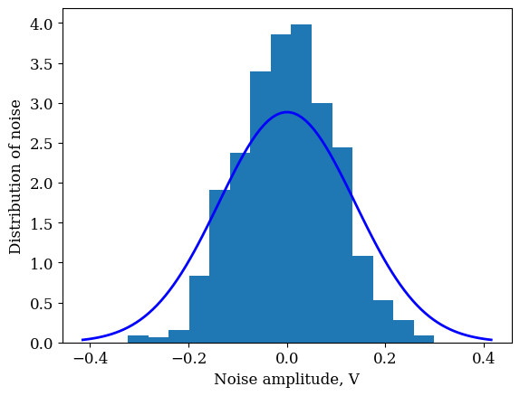

# In-phase / Quadrature data
Two files in this folder are the data file and the noise file. Both files contain (1000, 2, 39) arrays: (number of signals, I/Q = real/imag, number of samples in one signal).

## I/Q data signal
This figure shows the real and imaginary parts of two signals.

## Gaussian noise
The ground truth noise samples from the dataset, have mu <= 0.005 (booth, real or image) and
standard deviation sigma = 0.1361. The plot shows 3 sigma. This distribution function is used in
the signal reconstruction procedure.

*Noise*

## References
1. [In-phase and quadrature components](https://en.wikipedia.org/wiki/In-phase_and_quadrature_components) by Wiki
2. [What is I/Q Data? 5G in Wireless Communication](https://www.linkedin.com/pulse/what-iq-data-in-depth-look-reference-5g-wireless-ravi-shekhar-8ypqc/) by Ravi Shekhar Singh
3. [ I/Q Data for Dummies](http://whiteboard.ping.se/SDR/IQ) by Mikael Q Kuisma
4. [more references](../latex/)
