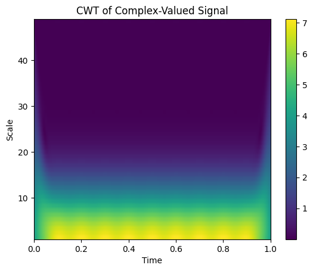

# Signal processing examples for this project 
These examples are mainly AI-generated. The collection is useful for analyzing the nature of the signal and for thinking of various ways of development. It contains a few comments. So the information mainly is in the title of the file.

- [6_10](6_10_Example_GenerateIQdatabySineWave.ipynb) Generate I/Q Data by Sine Wave 
- [6_11](6_11_Example_PhaseDifference_byHilbert.ipynb) Phase Difference by Hilbert Transform
- [6_12](6_12_Example_LowPassFilter_Hilbert_Average.ipynb) Low-Pass Filter, Hilbert Transform, and Averaging
- [6_1](6_1_Example_FastICA.ipynb) Fast Independent Component Analysis (ICA)
- [6_2](6_2_Example_FFT-ICA-MixtureDetection.ipynb) FFT-ICA Mixture Detection
- [6_3](6_3_Example_RescalingMovigAverages.ipynb) Rescaling and Moving Averages
- [6_5](6_5_Example_SinDataFit.ipynb) Sine Data Fitting
- [6_6](6_6_Example_FFT.ipynb) Fast Fourier Transform (FFT)
- [6_7](6_7_Example_Wavelet.ipynb) Wavelet Transform
- [6_8](6_8_Example_SVDforComplexValuedMatrix.ipynb) Singular Value Decomposition (SVD) for Complex-Valued Matrices

