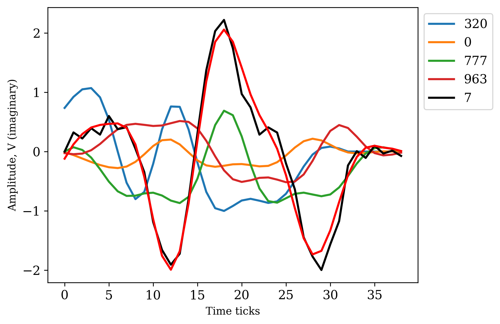
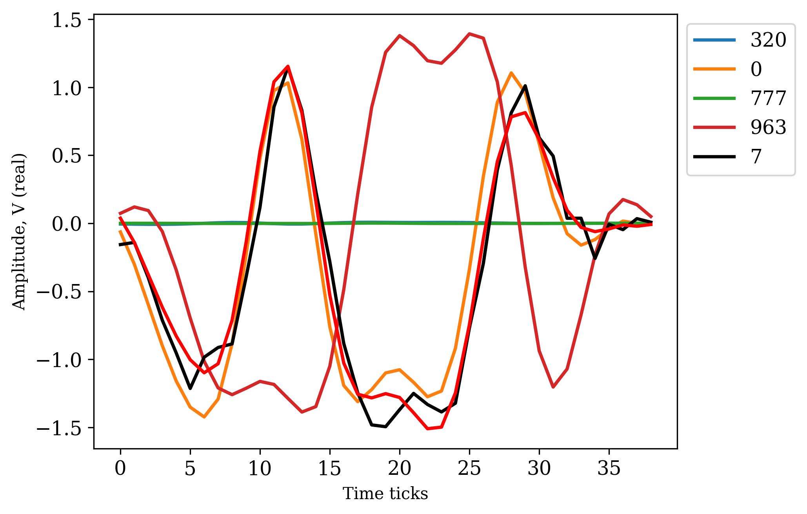
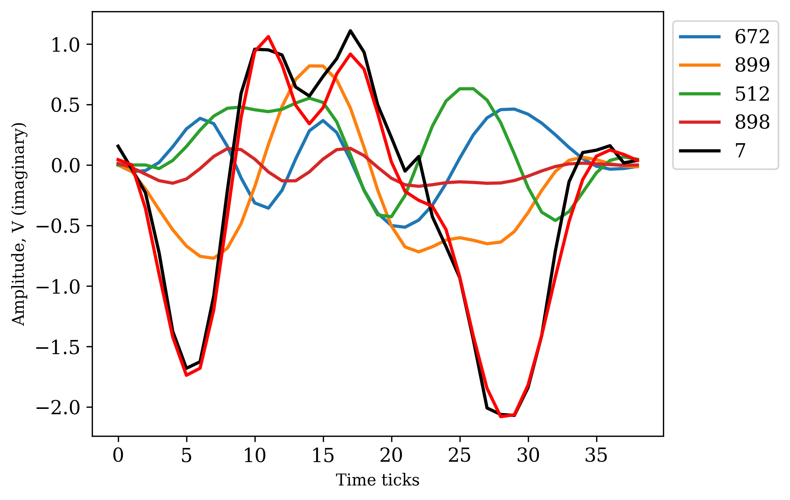
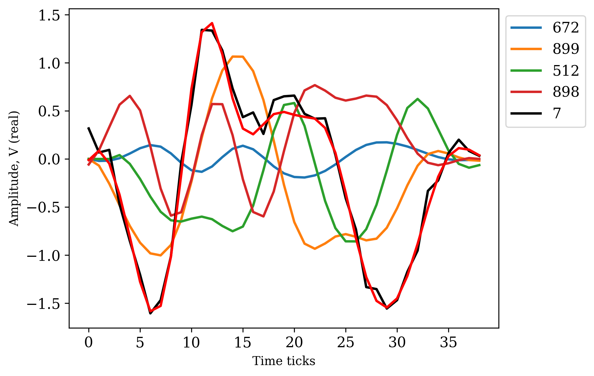
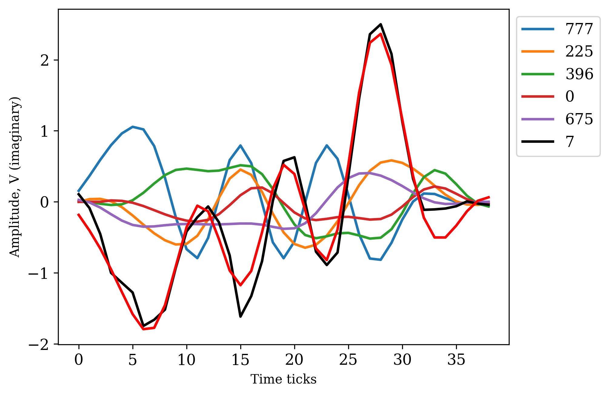
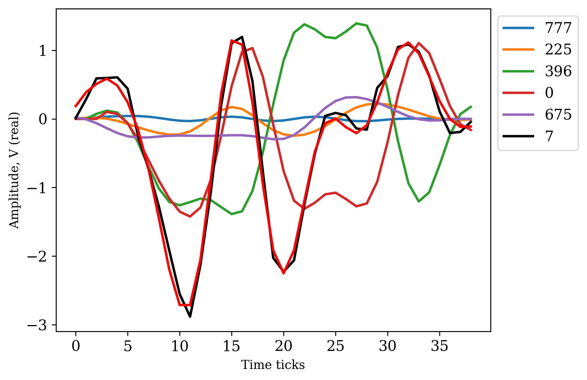

# Figures to illustrate the In-phase / Quadrature data analytic signal 

Original and reconstructed signal without the added noise

The standard deviation of the noise with its maximal values 

# Examples of the mixture signal separation
The figure shows the received signal (black), the reconstructed mixture (red), and the separated I/Q data signals to use as identifiers of tags in the inventory process. There are four signals in the separated mixture.

## Example 1

## Example 2

## Example 3

