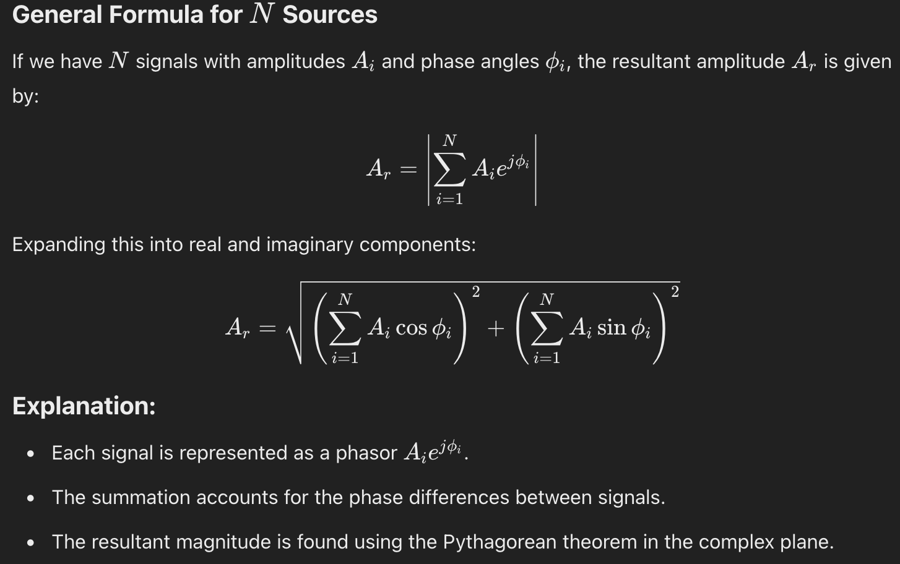

# Fast introduction to the In-phase / Quadrature data 

## I/Q data analytic signal
1. [I/Q Data for Dummies](http://whiteboard.ping.se/SDR/IQ) by Mikael Q Kuisma
2. [Mind your I's and Q's: The Basics of I/Q data](https://towardsdatascience.com/mind-your-is-and-q-s-the-basics-of-i-q-data-d1f2b0dd81f4) by Bryan and Barrett, 2022
3. [Quadrature Signals: Complex, But Not Complicated](https://www.ieee.li/pdf/essay/quadrature_signals.pdf) by Richard Lyons
4. [Understanding I/Q Signals and Quadrature Modulation](https://www.allaboutcircuits.com/textbook/radio-frequency-analysis-design/radio-frequency-demodulation/understanding-i-q-signals-and-quadrature-modulation/)

## Programming and Datasets
1. [How to do FFT on I/Q](https://fr.mathworks.com/matlabcentral/answers/2034154-how-to-do-fft-on-i-q-data) data by Mathworks
2. [Py SDR: Digital Modulation](https://pysdr.org/content/digital_modulation.html)
3. [RF modulation classification](https://github.com/kwyoke/RF_modulation_classification/tree/master) with [visualization](https://github.com/kwyoke/RF_modulation_classification/blob/master/dataset_visualisations.ipynb) by kwyoke
4. [Wi-Fi and Bluetooth I/Q Recordings in the 2.4 GHz and 5 GHz](https://catalog.data.gov/dataset/wi-fi-and-bluetooth-i-q-recordings-in-the-2-4-ghz-and-5-ghz-bands-with-low-cost-software-d) by NSTI and Adam Wunderlich
5. [PyRiemann 4-class classification](https://pyriemann.readthedocs.io/en/latest/auto_examples/biosignal-erp/plot_classify_EEG_tangentspace.html#sphx-glr-auto-examples-biosignal-erp-plot-classify-eeg-tangentspace-py) by Alexandre Barachant

## Birthday paradox
1. [https://pi.math.cornell.edu/~mec/2008-2009/TianyiZheng/Birthday.html](Birthday Problem): probability of pair, probability of no-match

## Wiki 
1. [Quadrature_amplitude_modulation](https://en.wikipedia.org/wiki/Quadrature_amplitude_modulation)
2. [In-phase_and_quadrature_components: I/Q_data](https://en.wikipedia.org/wiki/In-phase_and_quadrature_components#I/Q_data)
3. [Carrierless_amplitude_phase_modulation](https://en.wikipedia.org/wiki/Carrierless_amplitude_phase_modulation)
4. [Phase-shift_keyin](https://en.wikipedia.org/wiki/Phase-shift_keying)
5. [Amplitude_and_phase-shift_keying](https://en.wikipedia.org/wiki/Amplitude_and_phase-shift_keying)
6. [Constellation_shaping](https://en.wikipedia.org/wiki/Constellation_shaping)

## Miscellaneous 
1. [What is Slotted ALOHA?](https://www.geeksforgeeks.org/what-is-slotted-aloha/)
2. [ALOHA Class of Multiple Access Protocols](https://www.southampton.ac.uk/~sqc/EL336/CNL-7.pdf) by Sheng Chen
3. [Generalized singular spectrum analysis for the decomposition and analysis of non-stationary signals](https://doi.org/10.1016/j.jfranklin.2024.106696) by Jialiang Gu et al. 2024
4. [RFID on Reddid](https://www.reddit.com/r/RFID/)
5. [Current Trends and Challenges in RFID](https://www.intechopen.com/chapters/16527) by Kang and Prodanoff, 2010

## ALOHA Throughputs

## The signal mixture

