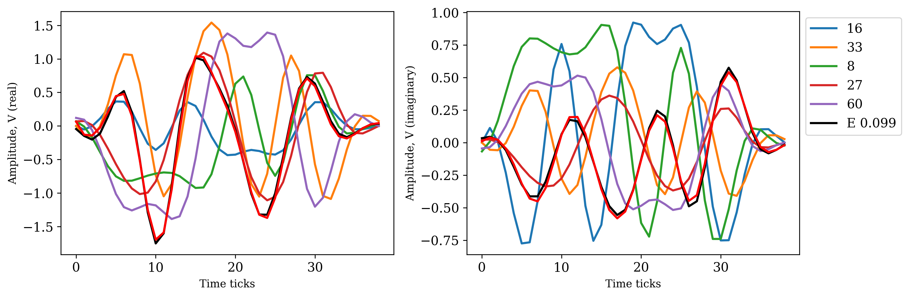

# I/Q signal reconstruction

No matter the collision, the transmitters could be identified, and data could be restored

Run the short demo in [signal_separation.ipynb](signal_separation.ipynb) or [.py](signal_separation.py). The modules *.functions.py*, *datagen.py*, *experiment.py*, and *plots.py* in their minimum versions are uploaded.

The figure shows the received signal (red), the reconstructed mixture (black), and the separated I/Q data signals to use as identifiers of tags in the inventory process. There are five signals in the separated mixture. 

[See more signal separation examples in figures](../figures#readme).
